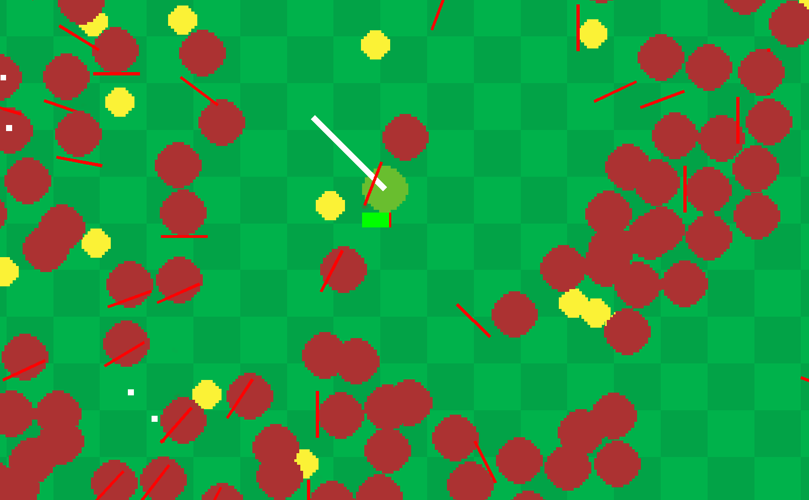

# Surviving Vampire 

A Vampire Survivors clone game written in C where you fight hordes of enemies with a sword and autofiring gun. 

Use the WASD keys to move. Pick up yellow coins to gain experience. Once you've gained enough, you'll heal and your sword will get a little bit longer.

## Cool Technical Features
- This game is written in C using the Oogabooga engine for rendering. Everything else is hand written by me.
- Support for up to 10,000 entities on screen
- Particle and screen shake system
- Project files for images/audio using Aseprite and Reaper Audio

## Builds 
This project uses a C unity build with Clang to keep things simple. I prefer to leave that purple Windows IDE over at my day job.

### Quickstart
Currently, we only support Windows x64 systems.
1. Make sure Windows SDK is installed
1. Install clang, add to path
1. Clone repo to <project_dir>
1. Run `build.bat`
1. Run build/cgame.exe
1. profit
